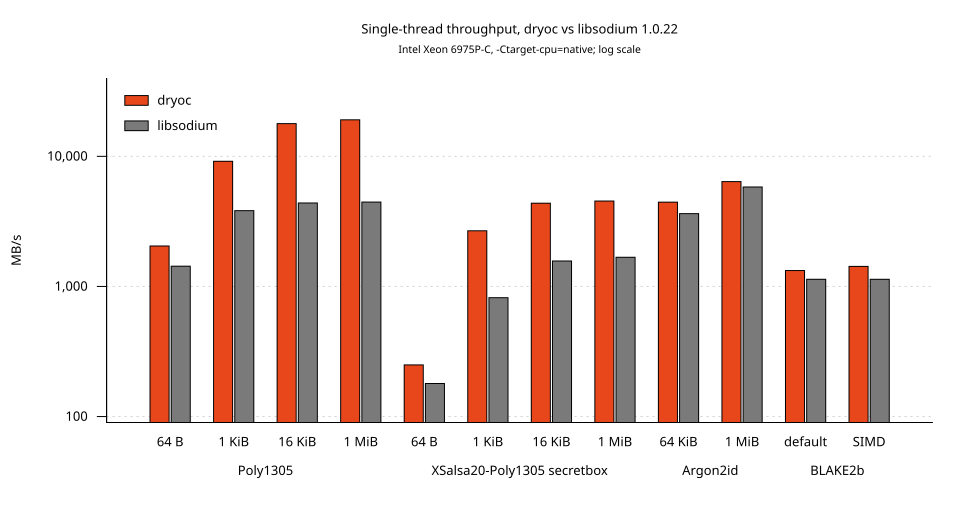
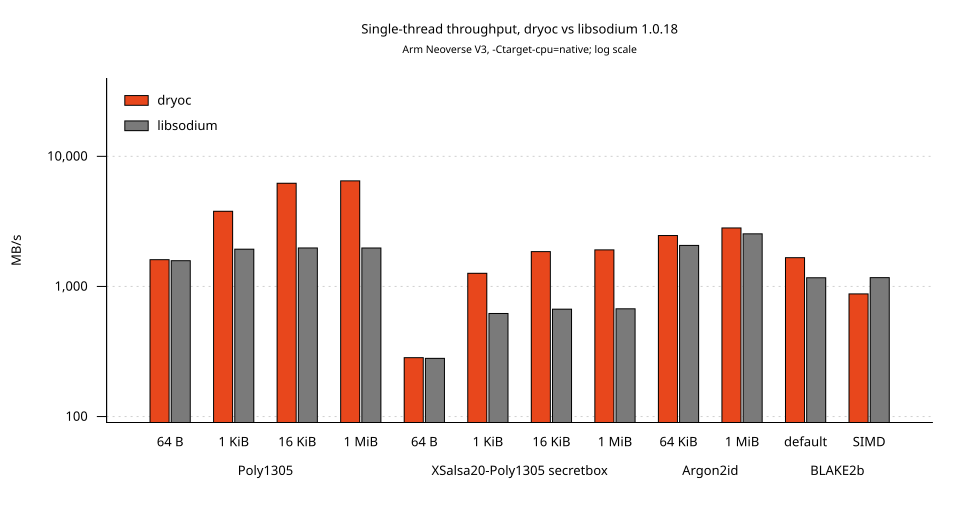

# Benchmarks

This page collects `dryoc` benchmark results by algorithm and implementation,
measured against libsodium on the same machine, in the same process, on the
same buffers. Results were collected on two machines, an Intel Xeon 6975P-C
(Granite Rapids) with AVX-512 and AVX-512 IFMA and an Arm Neoverse V3 with
NEON, SVE2 and the SHA-2/SHA-3 extensions; see [Environment](#environment) for
the full setup. Both machines were measured against libsodium 1.0.22: the
Xeon rows at `f33b8f8` (#194), the Neoverse V3 rows at #194. Results show
relative performance for the same API surface on those CPUs; they are not
portable guarantees.

## Headline

On the Xeon 6975P-C (measured at `f33b8f8`), dryoc's runtime-detected
AVX2/AVX-512 kernels beat libsodium 1.0.22 on every workload with
`-Ctarget-cpu=native`, and on all but the memory-bound Argon2id 1 MiB row
with no build flags at all:

| Workload | dryoc | libsodium | dryoc vs libsodium |
| --- | ---: | ---: | ---: |
| Poly1305, 1 MiB | `19,087 MB/s` | `4,451 MB/s` | `4.29x faster` |
| Poly1305, 16 KiB | `17,842 MB/s` | `4,380 MB/s` | `4.07x faster` |
| XSalsa20-Poly1305 secretbox, 1 MiB | `4,533 MB/s` | `1,676 MB/s` | `2.71x faster` |
| XSalsa20-Poly1305 secretbox, 1 KiB | `2,678 MB/s` | `820 MB/s` | `3.27x faster` |
| Argon2id, `t=2 m=64 KiB` | `4,446 MB/s` | `3,628 MB/s` | `1.23x faster` |
| Argon2id, `t=2 m=1 MiB` | `6,396 MB/s` | `5,813 MB/s` | `1.10x faster` |
| BLAKE2b, 694,200 B (portable SIMD) | `486,884 ns` | `611,619 ns` | `1.26x faster` |
| BLAKE2b, 694,200 B (default) | `523,856 ns` | `611,391 ns` | `1.17x faster` |
On the Neoverse V3 (rows below: `-Ctarget-cpu=native`, pinned to one core,
median of three runs), dryoc is ahead of libsodium 1.0.22 on every
default-backend row, including the 64-byte ones, and on each of those rows
the no-flags build is within 2.4% of these numbers. Only the opt-in
portable-SIMD BLAKE2b backend is slower than libsodium:

| Workload | dryoc | libsodium | dryoc vs libsodium |
| --- | ---: | ---: | ---: |
| Poly1305, 1 MiB | `7,134 MB/s` | `1,976 MB/s` | `3.61x faster` |
| Poly1305, 16 KiB | `6,931 MB/s` | `1,975 MB/s` | `3.51x faster` |
| XSalsa20-Poly1305 secretbox, 1 MiB | `2,699 MB/s` | `674 MB/s` | `4.00x faster` |
| XSalsa20-Poly1305 secretbox, 1 KiB | `1,618 MB/s` | `621 MB/s` | `2.60x faster` |
| Argon2id, `t=2 m=64 KiB` | `4,000 MB/s` | `1,410 MB/s` | `2.84x faster` |
| Argon2id, `t=2 m=1 MiB` | `5,032 MB/s` | `1,637 MB/s` | `3.07x faster` |
| BLAKE2b, 694,200 B (default) | `417,771 ns` | `594,888 ns` | `1.42x faster` |
| BLAKE2b, 694,200 B (portable SIMD) | `792,951 ns` | `595,068 ns` | `1.33x slower` |
| ML-KEM-768 decapsulation | `6,952 ns` | `26,405 ns` | `3.80x faster` |
| X-Wing decapsulation | `40,556 ns` | `94,106 ns` | `2.32x faster` |

Part of the Argon2id margin is libsodium's: 1.0.22 always selects its NEON
block compression on AArch64, and on this core that is slower than the
portable code of 1.0.18; see
[Password Hashing: Argon2id](#password-hashing-argon2id).






On the Xeon, the Poly1305, Salsa20, Argon2 and BLAKE2b kernels are selected
at runtime by CPU feature detection. On the Neoverse V3 the SVE2 Salsa20 and
Argon2 kernels and the ML-KEM NEON and SHA3-extension kernels are, while the
Poly1305 block loops and the BLAKE2b rounds are `asm!` in baseline AArch64
instructions, selected at compile time by target architecture. The
runtime-selected kernels do not require `-Ctarget-cpu=native` to be used;
what the flag changes on each machine is measured in
[Without `target-cpu=native`](#without-target-cpunative). Only the BLAKE2b
portable-SIMD rows need the `simd_backend,nightly` build; on the Xeon that
row also needs `target-cpu=native` to come out ahead.

## Environment

These results were collected on:

| Item | Intel Xeon 6975P-C | Arm Neoverse V3 |
| --- | --- | --- |
| Machine | Cloud VM (c8i.8xlarge), 32 vCPUs, pinned to one core with `taskset -c 7` | Cloud VM, 192 vCPUs |
| CPU | Intel Xeon 6975P-C (Granite Rapids; AVX2, AVX-512F/VL, AVX-512 IFMA) | Arm Neoverse V3 r0p1 (NEON, SVE/SVE2, `sha2`, `sha3`, `sha512`) |
| Architecture | `x86_64-unknown-linux-gnu` | `aarch64-unknown-linux-gnu` |
| OS | Debian 13, Linux `6.12.107+deb13-cloud-amd64` | Debian 13, Linux `6.12.107+deb13-cloud-arm64` |
| Rust | `rustc 1.100.0-nightly (5ceaf6608 2026-09-25)` | `rustc 1.100.0-nightly (6eeff9a52 2026-09-23)` |
| Cargo | `cargo 1.100.0-nightly (3d7cf6e93 2026-09-25)` | `cargo 1.100.0-nightly (98a09e7e7 2026-09-21)` |
| Target CPU | `native` unless stated otherwise | `native` unless stated otherwise |
| dryoc revision | `f33b8f8` (#194) | #194 |
| libsodium | `1.0.22`, statically linked from the `libsodium-sys-stable 1.24.0` bundled source, built with its default flags | `1.0.22`, statically linked from the `libsodium-sys-stable 1.24.0` bundled source, built with its default flags |
| Sampling | pinned to one core with `taskset -c 7`, median of three runs | pinned to one core with `taskset -c 7`, median of three runs |

Commands used for the rows below:

```sh
export RUSTFLAGS="-Ctarget-cpu=native"

# Software backends, plus the libsodium baseline rows.
cargo +nightly bench --features nightly

# Portable-SIMD backends (BLAKE2b, and Argon2 block mixing on AArch64; on
# x86-64 the runtime-detected Argon2 kernel is used either way).
cargo +nightly bench --features simd_backend,nightly
```

On both machines the same commands were run under `taskset -c 7` three
times each, both with `-Ctarget-cpu=native` and with no `RUSTFLAGS`, on an
otherwise idle core, and the median `ns/iter` is reported. Across the 146
rows measured on the Neoverse V3, the run-to-run spread (max minus min over
the median) was below 1% on 139 rows and below 1.7% on all but four; the
noisiest row was dryoc's secretbox 16 KiB in the no-flags build, 6,784–6,994
ns around a 6,895 ns median (3.0%). On the Xeon rerun, every Poly1305,
secretbox, BLAKE2b and KEM row was within 0.6% across the three runs; the
noisiest fresh rows were Poly1305 1 MiB (54,932–56,920 ns native, 3.6%) and
Argon2id 1 MiB (no-flags dryoc 366,556–375,843 ns, 2.5%; no-flags libsodium
358,210–362,886 ns, 1.3%). Ratios in the tables that round to `1.00x`–`1.03x`
are within that noise.

The charts are rendered from
[`benchmarks/results-x86_64.dat`](benchmarks/results-x86_64.dat) and
[`benchmarks/results-aarch64.dat`](benchmarks/results-aarch64.dat) (the
`ns/iter` figures from the tables) by
[`benchmarks/charts.gp`](benchmarks/charts.gp); regenerate them with
`gnuplot -c benchmarks/charts.gp` after updating a data file.

Each `*_bench` has a `libsodium_*_bench` twin in
the same test module that runs the corresponding libsodium function on the
same input sizes after `sodium_init()`, so libsodium uses its own
runtime-selected implementation. On both machines the twins call libsodium
through the `libsodium-sys-stable` bindings. `RUSTFLAGS` does not affect the
C library; its numbers were identical within noise across every build below.

Kernels selected at runtime on each CPU:

| Algorithm | dryoc kernel, Xeon 6975P-C | libsodium 1.0.22, Xeon | dryoc kernel, Neoverse V3 | libsodium, Neoverse V3 |
| --- | --- | --- | --- | --- |
| Poly1305 | AVX-512 IFMA, 3x44-bit limbs, two chains for long runs (`poly1305_x86_64`) | `sse2` (Poly1305-donna) | `asm!` radix-2^64 block loops on the integer multipliers, four Horner lanes for runs of at least 384 bytes (`poly1305_aarch64`) | `donna` (64-bit, 3x44-bit limbs) |
| Salsa20 (secretbox) | AVX-512F/VL 16-block lane set (`salsa20_x86_64`) | `xmm6int` AVX2 | SVE2 `xar` 4-block vector set plus scalar blocks in the same `asm!` block, with secretbox's Poly1305 in that block too (`salsa20_neon`) | `ref` (scalar) |
| Argon2 block mixing | AVX-512F (`argon2_x86_64`) | `avx512f` | SVE2 `asm!`, three states in vectors beside five on the integer registers (`argon2_neon`) | `neon` |
| BLAKE2b | AVX-512VL `vprorq` rotations on a 256-bit lane set (`blake2b_x86_64`), or portable SIMD with `simd_backend,nightly` | `avx2` | scalar `asm!` rounds (`blake2b_aarch64`), or portable SIMD with `simd_backend,nightly` | `ref` (scalar) |
| ML-KEM-768 and X-Wing | AVX2 NTT/multiply-add (`mlkem_x86_64`), 4-way AVX2 Keccak | reference C + reference Keccak | NEON NTT/multiply-add, 3-way (`keccak3_aarch64`) or 2-way SHA3-extension Keccak, X25519 on the `fe64_aarch64` field | reference C + reference Keccak |

libsodium 1.0.22 has AArch64 NEON code for one of these four algorithms,
Argon2, which it compiles in whenever the target has NEON (every AArch64
target) and then always selects; its Poly1305, Salsa20 and BLAKE2b rows on
the Neoverse V3 are its portable C code. This was checked against the linked
artifact, not just the source: `nm` on the AArch64 bench binary lists
`crypto_onetimeauth_poly1305_donna_implementation`,
`crypto_stream_salsa20_ref_implementation`, `argon2_fill_segment_neon` and
`blake2b_compress_ref` behind the `*_pick_best_implementation` selectors, and
no other variant of these four algorithms. On the Xeon the same check lists
`crypto_onetimeauth_poly1305_{donna,sse2}_implementation`,
`crypto_stream_salsa20_xmm6int_avx2_implementation` (beside its `ref` and
`sse2` twins), `argon2_fill_segment_{ref,avx2,avx512f}` and
`blake2b_compress_{ref,sse41,avx2}`. Its ML-KEM uses the reference
Keccak (`sodium_keccak1600_ref_*`); the SHA3-extension Keccak in the 1.0.22
source is not in the binary.

## One-Time Authentication: Poly1305

Benchmark: authenticate fixed-size messages with Poly1305 (`Poly1305::new`,
`update`, `finalize_to_array`). The libsodium rows call
`crypto_onetimeauth_poly1305`.

### Intel Xeon 6975P-C

| Message size | dryoc time | dryoc throughput | libsodium time | libsodium throughput | Relative |
| ---: | ---: | ---: | ---: | ---: | ---: |
| 64 B | `31.28 ns/iter` | `2,046 MB/s` | `44.71 ns/iter` | `1,431 MB/s` | `1.43x faster` |
| 1 KiB | `111.75 ns/iter` | `9,163 MB/s` | `267.76 ns/iter` | `3,824 MB/s` | `2.40x faster` |
| 16 KiB | `918.26 ns/iter` | `17,842 MB/s` | `3,740.46 ns/iter` | `4,380 MB/s` | `4.07x faster` |
| 1 MiB | `54,935.39 ns/iter` | `19,087 MB/s` | `235,565.14 ns/iter` | `4,451 MB/s` | `4.29x faster` |

The scalar backend keeps the accumulator in three 44-bit limbs and hands runs
of full blocks to a runtime-detected bulk path: AVX2 or AVX-512F lanes in
5x26-bit limbs, or, on CPUs with `avx512ifma`, 3x44-bit lanes multiplied
with `vpmadd52luq`/`vpmadd52huq`. Each bulk kernel processes a chunk of
consecutive blocks as independent Horner lanes and folds them with one power
of `r` per block, so the result is bit-identical to the serial evaluation.
Every iteration executes the same instructions regardless of data. libsodium
1.0.22 has no AVX2 or AVX-512 Poly1305 (`nm` on the Xeon bench binary lists
only `crypto_onetimeauth_poly1305_donna_implementation` and
`crypto_onetimeauth_poly1305_sse2_implementation` behind the
`*_pick_best_implementation` selector) and tops out at its SSE2 donna path.

The 64-byte row has no bulk path on either side (the IFMA path needs at
least 256 bytes); the gap there is the scalar `u128` 3-limb multiply against
the 32-bit limbs of the `sse2` implementation libsodium selects on x86-64.
(Its 64-bit `donna` implementation, selected on AArch64, uses the same
44/44/42-bit `u128` limbs as dryoc's portable scalar code.)

### Arm Neoverse V3

| Message size | dryoc time | dryoc throughput | libsodium time | libsodium throughput | Relative |
| ---: | ---: | ---: | ---: | ---: | ---: |
| 64 B | `23.04 ns/iter` | `2,778 MB/s` | `39.80 ns/iter` | `1,608 MB/s` | `1.73x faster` |
| 1 KiB | `208.69 ns/iter` | `4,907 MB/s` | `525.07 ns/iter` | `1,950 MB/s` | `2.52x faster` |
| 16 KiB | `2,363.95 ns/iter` | `6,931 MB/s` | `8,294.04 ns/iter` | `1,975 MB/s` | `3.51x faster` |
| 1 MiB | `146,985.10 ns/iter` | `7,134 MB/s` | `530,544.90 ns/iter` | `1,976 MB/s` | `3.61x faster` |

On AArch64 the block loops are `asm!` on the integer multipliers in radix
2^64 (the Poly1305-donna-64 representation): multiplying by the clamped `r`
directly, a block is ten `mul`/`umulh` where 3x44-bit limbs take eighteen
multiplies. One lane is bound by its Horner step's latency (about fifteen
cycles on this core), so runs of at least 384 bytes are split into four
contiguous quarters processed as independent lanes, which overlap to the
multipliers' throughput (about 7.5 cycles per block), and joined at the end
with powers of `r`, so the result is bit-identical to the serial
evaluation. Shorter runs, including the 64-byte row, take the one-lane loop.
Control flow and memory access depend only on the input length. These loops
replace the NEON 5x26-bit kernel previously measured here (`270.70` and
`161,823.55 ns/iter` at 1 KiB and 1 MiB), which only matched them with a
key-power setup that cost more than the four-lane join.

The portable-SIMD Poly1305 backend (`poly1305_simd`) is compiled only for
tests on x86-64 and AArch64 because it is slower than the target-specific
kernels. For reference, with `simd_backend,nightly` and `target-cpu=native`
it measured `78.36 ns/iter` (64 B), `915.20 ns/iter` (1 KiB),
`14,612.27 ns/iter` (16 KiB) and `935,975.80 ns/iter` (1 MiB), about
`1,120 MB/s`, on the Xeon, and `75.68`, `458.37`, `6,638.87` and
`413,281.10 ns/iter`, about `2,537 MB/s`, on the Neoverse V3: ahead of
libsodium's scalar code from 1 KiB up but 2.8x behind the `asm!` loops.
Rust portable SIMD cannot express the widening multiply-accumulate shapes
(`vpmuludq`, `vpmadd52luq`) that make the x86-64 kernels fast, and a vector
lane set does not beat the AArch64 integer multipliers on this core.

References: [RFC 8439](https://www.rfc-editor.org/rfc/rfc8439),
[Improved SIMD Implementation of Poly1305, ePrint 2019/842](https://eprint.iacr.org/2019/842.pdf),
and [poly1305-donna](https://github.com/floodyberry/poly1305-donna).

## Secretbox: XSalsa20-Poly1305

Benchmark: `crypto_secretbox_detached` encrypts a fixed-size message into a
preallocated ciphertext buffer and computes the Poly1305 tag. This measures the
combined XSalsa20 stream and Poly1305 authentication path used by secretbox
and `crypto_box`. The libsodium rows call `crypto_secretbox_detached` with the
same buffers.

### Intel Xeon 6975P-C

| Message size | dryoc time | dryoc throughput | libsodium time | libsodium throughput | Relative |
| ---: | ---: | ---: | ---: | ---: | ---: |
| 64 B | `256.60 ns/iter` | `249 MB/s` | `356.66 ns/iter` | `179 MB/s` | `1.39x faster` |
| 1 KiB | `382.36 ns/iter` | `2,678 MB/s` | `1,249.26 ns/iter` | `820 MB/s` | `3.27x faster` |
| 16 KiB | `3,754.75 ns/iter` | `4,364 MB/s` | `10,442.87 ns/iter` | `1,569 MB/s` | `2.78x faster` |
| 1 MiB | `231,302.05 ns/iter` | `4,533 MB/s` | `625,743.70 ns/iter` | `1,676 MB/s` | `2.71x faster` |

The XSalsa20 keystream comes from a runtime-detected lane-set kernel: eight
blocks per `ymm` lane set under AVX2, sixteen per `zmm` lane set under
AVX-512F, with the AVX-512VL variant using `vprold` rotations and the 32 EVEX
registers for short tails. Lane `i` of every state vector belongs to block
`counter + i`, so the rounds are plain lane-wise arithmetic and the blocks are
transposed once before the XOR. The tag is then computed by the Poly1305
kernel above. The 64-byte row is dominated by the fixed HSalsa20 subkey
derivation and the first Salsa20 block on both sides.

On x86-64 the `simd_backend` feature does not change this path (the
portable-SIMD Salsa20 lane set is slower than the AVX2/AVX-512 kernels and is
compiled only for tests); the `simd_backend,nightly` build measured
`256.68`, `383.78`, `3,782.47` and `232,404.25 ns/iter`, identical within
noise.

### Arm Neoverse V3

| Message size | dryoc time | dryoc throughput | libsodium time | libsodium throughput | Relative |
| ---: | ---: | ---: | ---: | ---: | ---: |
| 64 B | `181.26 ns/iter` | `353 MB/s` | `227.72 ns/iter` | `281 MB/s` | `1.26x faster` |
| 1 KiB | `633.00 ns/iter` | `1,618 MB/s` | `1,647.86 ns/iter` | `621 MB/s` | `2.60x faster` |
| 16 KiB | `6,907.57 ns/iter` | `2,372 MB/s` | `24,444.73 ns/iter` | `670 MB/s` | `3.54x faster` |
| 1 MiB | `388,473.70 ns/iter` | `2,699 MB/s` | `1,554,919.20 ns/iter` | `674 MB/s` | `4.00x faster` |

On this CPU the runtime detection picks the SVE2 kernel: one four-block
vector set whose quarter-round step is `add` + `xar` + `xar` (a two-deep
dependency chain against four for plain NEON), with scalar blocks computed
from general-purpose registers in the same `asm!` block on the spare integer
pipes. For secretbox the Poly1305 of each 320-byte chunk (the vector set's
four blocks and one scalar block) runs in that `asm!` block too, on the
integer multipliers the Salsa20 rounds leave idle, so the keystream, the XOR
and the tag take one pass over the data. The block that supplies the
Poly1305 key rides along with the first data blocks in one run. The NEON and
NEON+`sha3` (`eor3`) kernels are the fallbacks for cores without SVE2.
libsodium has only its scalar `ref` Salsa20 and 64-bit donna Poly1305 on
AArch64, so the gap here is vector-plus-stitched against scalar. The 64-byte
row is the fixed HSalsa20 plus two Salsa20 blocks on both sides; dryoc
computes the two blocks interleaved on the integer registers.

As on x86-64, `simd_backend` does not change this path on AArch64; the
`simd_backend,nightly` build measured `180.08`, `629.32`, `6,930.94` and
`389,094.90 ns/iter`.

## Password Hashing: Argon2id

Benchmark: `argon2_hash` with a fixed 32-byte password, 16-byte salt, 32-byte
output, `t=2`, and `p=1`. Throughput is `t * m` bytes of block memory per
second. The libsodium rows call its `argon2_hash` with the same parameters.

### Intel Xeon 6975P-C

| Memory cost | dryoc time | dryoc throughput | libsodium time | libsodium throughput | Relative |
| ---: | ---: | ---: | ---: | ---: | ---: |
| 64 KiB | `29,483.97 ns/iter` | `4,446 MB/s` | `36,131.62 ns/iter` | `3,628 MB/s` | `1.23x faster` |
| 1 MiB | `327,890.05 ns/iter` | `6,396 MB/s` | `360,764.35 ns/iter` | `5,813 MB/s` | `1.10x faster` |

Both sides run an AVX-512F block compression here (`nm` on the Xeon bench
binary lists `argon2_fill_segment_avx512f` beside the `avx2` and `ref`
variants). dryoc's kernel holds two 16-word states side by side in each
512-bit vector and rotates with `vprorq`; the surrounding memory indexing
and lane scheduling are the shared portable code. The 1 MiB row is
memory-bound and the noisiest in this suite: across three native runs dryoc
measured 327.9–328.3 µs and libsodium 360.5–362.2 µs.

With `simd_backend,nightly` the Argon2id rows are nearly unchanged on x86-64
(`33,843.92` and `330,041.90 ns/iter`) because the runtime-detected AVX-512
kernel is preferred over the portable-SIMD block mixer.

### Arm Neoverse V3

| Memory cost | dryoc time | dryoc throughput | libsodium time | libsodium throughput | Relative |
| ---: | ---: | ---: | ---: | ---: | ---: |
| 64 KiB | `32,768.21 ns/iter` | `4,000 MB/s` | `92,972.52 ns/iter` | `1,410 MB/s` | `2.84x faster` |
| 1 MiB | `416,792.90 ns/iter` | `5,032 MB/s` | `1,280,744.20 ns/iter` | `1,637 MB/s` | `3.07x faster` |

dryoc runs the runtime-detected SVE2 kernel (`argon2_neon`): each of the
permutation's two passes (over the block's eight rows, then its eight
columns) is one `asm!` block in which three of the eight 16-word states run
as vectors while the other five run one after the other on the integer
registers, so the vector and integer pipes work at the same time. A vector
`G` step is `add`, `umullb`, `adr` and `xar`, four lane-wise instructions.
The memory indexing and lane scheduling around it are the shared portable
code.

libsodium 1.0.22 runs its NEON block compression, which it selects on every
AArch64 build, and on this core that is slower than the portable `ref` code
libsodium 1.0.18 used: the previous revision of this page measured 1.0.18 at
`63,409.51` and `826,501.80 ns/iter` on the same machine type, against
`92,972.52` and `1,280,744.20 ns/iter` for 1.0.22 here. Against the 1.0.18
numbers dryoc would be `1.94x` and `1.98x` faster, so part of the margin in
the table is libsodium's regression. dryoc's own change over the previous
revision's crates.io-default rows (`40,817` / `544,960 ns/iter`, scalar
`argon2_soft`) is `1.22x` and `1.30x`, comparing no-flags builds (see
[Without `target-cpu=native`](#without-target-cpunative)).

`-Ctarget-cpu=native` no longer changes this path: the previous revision
found the native build 30–37% *slower*, because the flag enabled SVE and LLVM
auto-vectorized the scalar `argon2_soft` rounds. The block compression is now
`asm!` whenever SVE2 is detected, and the native build is within 2.4% of the
default one.

With `simd_backend,nightly` the SVE2 kernel is still preferred over the
portable-SIMD block mixer, as the AVX-512 kernel is on x86-64, but the rows
are slower: `43,811.42` and `428,746.35 ns/iter` with `target-cpu=native`,
and `52,850.87` / `437,021.90 ns/iter` without flags. The difference is
about the same at both memory costs (11–12 µs native, 18–19 µs without
flags), so it lies in the fixed per-hash work outside the block fill: that
is BLAKE2b (the initial hash and the `blake2b_long` expansions), whose
portable-SIMD backend is the slow option on this core (see
[Generic Hashing: BLAKE2b](#generic-hashing-blake2b)). The default backend
is the right choice for Argon2 on AArch64.

## Generic Hashing: BLAKE2b

Benchmark: hash a 694,200-byte buffer and produce a 64-byte output
(`State::init`, `update`, `finalize`). The libsodium row calls
`crypto_generichash_blake2b` on the same buffer.

### Intel Xeon 6975P-C

| Implementation | Feature set | Time | vs libsodium | vs default |
| --- | --- | ---: | ---: | ---: |
| libsodium `avx2` | – | `611,391.20 ns/iter` | `1.00x` | `1.17x slower` |
| Default (AVX-512VL kernel) | `nightly` | `523,855.90 ns/iter` | `1.17x faster` | `1.00x` |
| Portable SIMD | `simd_backend,nightly` | `486,883.65 ns/iter` | `1.26x faster` | `1.08x faster` |
| Portable scalar (`compress_portable`) | `nightly`, before the kernel | `663,811.90 ns/iter` | `1.08x slower` | `1.27x slower` |

The default backend compresses each block through a runtime-detected x86-64
kernel: the 16-word state as four `ymm` rows so the four `G` mixings of a
step are one lane-wise `G`, with the message vectors assembled by the BLAKE2
reference AVX2 unpack/align/blend schedule. Its AVX2 variant has to rotate
lanes with shuffles (`vpshufd`, `vpshufb`), which compete with the message
shuffles for the shuffle port and leave it only 3–4% ahead of libsodium's
AVX2 code; the AVX-512VL variant, the same 256-bit lane set with one `vprorq`
per rotation, is what opens the gap on this CPU. The portable scalar row is
the same benchmark measured before the kernel was added, for reference.

The portable-SIMD backend vectorizes the same four-lane layout with
`Simd<u64, 4>` and, compiled with `-Ctarget-cpu=native`, is still 7% faster:
LLVM lowers its rotations to `vprolq` as well, and its compression is
inlined into the `update` loop, whereas the runtime-dispatched kernel is a
`#[target_feature]` function called once per 128-byte block. It remains
opt-in because it needs nightly Rust and its advantage depends on the
compile-time target: with the baseline x86-64 target the lane set is lowered
to SSE2 width and it is slower than the default backend.

### Arm Neoverse V3

| Implementation | Feature set | Time | vs libsodium | vs default |
| --- | --- | ---: | ---: | ---: |
| libsodium `ref` | – | `594,887.80 ns/iter` | `1.00x` | `1.42x slower` |
| Default (`asm!` rounds) | `nightly` | `417,771.30 ns/iter` | `1.42x faster` | `1.00x` |
| Portable SIMD | `simd_backend,nightly` | `792,951.20 ns/iter` | `1.33x slower` | `1.90x slower` |

The default backend on AArch64 is scalar: `blake2b_aarch64::rounds` emits
each `G` step `z = (z ^ x) >>> r` as `ror` followed by `eor` with a rotated
operand, so a step is two dependent instructions instead of three, and the
message words are loaded from the block with immediate offsets so the state
and temporaries stay in registers. That is enough to beat libsodium's scalar
`ref` by 42% with the 64-bit integer pipes alone.

The portable-SIMD backend is 1.9x slower than the scalar rounds with
`target-cpu=native` (`792,951.20 ns/iter`). Without flags it measures
`1,396,414.70 ns/iter`, 3.4x slower. With `target-cpu=native` LLVM lowers its `Simd<u64, 4>`
rotations to SVE2 `xar` and its diagonal shuffles to `ext` permutes; why that
loses to the scalar rounds on this core has not been profiled. On AArch64,
`simd_backend` should not be enabled for BLAKE2b performance.

## Key Encapsulation: ML-KEM-768 and X-Wing

`classic::crypto_kem_mlkem768` and `classic::crypto_kem_xwing` benches: key
generation from a seed, deterministic encapsulation, and decapsulation of a
valid ciphertext. These rows compare against libsodium 1.0.22 (statically
linked from the `libsodium-sys-stable 1.24.0` bundled source, built with its
default flags), since 1.0.18 has no KEM. On the Neoverse V3 they were
measured the same way as the other rows there; on the Xeon the same way as
the other Xeon rows (`-Ctarget-cpu=native`, `taskset -c 7`, median of three
runs).

On the Xeon, dryoc runs the polynomial arithmetic with the runtime-detected
AVX2 kernels (`mlkem_x86_64`: sixteen 16-bit lanes per `ymm` register, with
the Keccak permutations four at a time through the AVX2 kernel in
`keccak_x86_64.rs`), and X25519 on the portable five-limb field
(`fe25519_soft`). libsodium 1.0.22's ML-KEM is its portable reference code
with the reference Keccak (`sodium_keccak1600_ref_*` is what `nm` finds in
the bench binary, alongside `crypto_kem_mlkem768_*` and `crypto_kem_xwing_*`;
the SHA3-extension Keccak in the 1.0.22 source is not in the binary).

On the Neoverse V3, dryoc runs the NTT, the multiply-add, rejection
sampling, decompression and message decoding with NEON, and the Keccak
permutations three at a time with the SHA3 extension: two in NEON vectors
beside one on the integer registers, with the H(ek) and J(z‖c) hashes
filling slots that would otherwise be idle.

X-Wing adds X25519 scalar multiplications: one for key generation, two for
encapsulation and two for decapsulation, which also regenerates the ML-KEM
key pair from the seed. On the Neoverse V3 dryoc's run on a four-limb `asm!`
field with a constant-time Bernstein–Yang inversion; in encapsulation and
decapsulation the base-point multiplication and the exchange share one
inversion, with the base-point additions interleaved into the exchange's
ladder. X25519 is a larger share of X-Wing's time, so its speedup is smaller
than ML-KEM's.

### Intel Xeon 6975P-C

| Operation | dryoc | libsodium | dryoc vs libsodium |
| --- | ---: | ---: | ---: |
| ML-KEM-768 key generation | `16,273 ns` | `26,127 ns` | `1.61x faster` |
| ML-KEM-768 encapsulation | `15,927 ns` | `30,715 ns` | `1.93x faster` |
| ML-KEM-768 decapsulation | `16,994 ns` | `36,593 ns` | `2.15x faster` |
| X-Wing key generation | `26,761 ns` | `39,761 ns` | `1.49x faster` |
| X-Wing encapsulation | `51,600 ns` | `76,903 ns` | `1.49x faster` |
| X-Wing decapsulation | `63,988 ns` | `109,610 ns` | `1.71x faster` |

With `simd_backend,nightly` the same kernels measured faster on this
CPU: ML-KEM key generation `9,088`, encapsulation `9,662` and decapsulation
`10,733 ns` (37–44% faster), X-Wing `19,238`, `45,150` and `51,384 ns`
(12–28% faster). There is no portable-SIMD ML-KEM or Keccak backend —
`grep simd_backend` across `src/mlkem/`, `src/keccak/`, `src/sha3.rs` and
`src/xof.rs` finds no gates — so both builds run the kernels above; why the
timings differ has not been profiled.

### Arm Neoverse V3

| Operation | dryoc | libsodium | dryoc vs libsodium |
| --- | ---: | ---: | ---: |
| ML-KEM-768 key generation | `5,807 ns` | `17,360 ns` | `2.99x faster` |
| ML-KEM-768 encapsulation | `5,914 ns` | `20,138 ns` | `3.40x faster` |
| ML-KEM-768 decapsulation | `6,952 ns` | `26,405 ns` | `3.80x faster` |
| X-Wing key generation | `13,699 ns` | `31,113 ns` | `2.27x faster` |
| X-Wing encapsulation | `35,781 ns` | `69,871 ns` | `1.95x faster` |
| X-Wing decapsulation | `40,556 ns` | `94,106 ns` | `2.32x faster` |

The libsodium column is unchanged from the previous revision of this page
(within 0.4%); dryoc's rows were `9,280`, `10,643`, `13,687`, `21,508`,
`52,348` and `66,048 ns` before #194.

## Without `target-cpu=native`

The same `cargo +nightly bench --features nightly` run with no `RUSTFLAGS`,
which is what a crates.io consumer gets by default. The runtime-detected
kernels are compiled with per-function `target_feature` attributes, so they
are used without any build flags on both machines; on the Xeon that covers
Poly1305, secretbox, Argon2id and the ML-KEM/X-Wing rows, on the Neoverse V3
secretbox, Argon2id and the ML-KEM kernels.

### Intel Xeon 6975P-C

| Workload | dryoc time | dryoc throughput | libsodium time | libsodium throughput | Relative |
| --- | ---: | ---: | ---: | ---: | ---: |
| Poly1305, 64 B | `31.78 ns/iter` | `2,014 MB/s` | `44.70 ns/iter` | `1,432 MB/s` | `1.41x faster` |
| Poly1305, 1 KiB | `116.81 ns/iter` | `8,766 MB/s` | `267.89 ns/iter` | `3,822 MB/s` | `2.29x faster` |
| Poly1305, 16 KiB | `930.06 ns/iter` | `17,616 MB/s` | `3,740.71 ns/iter` | `4,380 MB/s` | `4.02x faster` |
| Poly1305, 1 MiB | `56,200.27 ns/iter` | `18,658 MB/s` | `235,266.88 ns/iter` | `4,457 MB/s` | `4.19x faster` |
| Secretbox, 64 B | `256.92 ns/iter` | `249 MB/s` | `357.57 ns/iter` | `179 MB/s` | `1.39x faster` |
| Secretbox, 1 KiB | `392.11 ns/iter` | `2,612 MB/s` | `1,246.97 ns/iter` | `821 MB/s` | `3.18x faster` |
| Secretbox, 16 KiB | `3,775.91 ns/iter` | `4,339 MB/s` | `10,429.47 ns/iter` | `1,571 MB/s` | `2.76x faster` |
| Secretbox, 1 MiB | `231,843.10 ns/iter` | `4,523 MB/s` | `626,616.80 ns/iter` | `1,673 MB/s` | `2.70x faster` |
| Argon2id, 64 KiB | `32,418.98 ns/iter` | `4,043 MB/s` | `36,021.00 ns/iter` | `3,639 MB/s` | `1.11x faster` |
| Argon2id, 1 MiB | `374,195.30 ns/iter` | `5,604 MB/s` | `360,096.50 ns/iter` | `5,824 MB/s` | `1.04x slower` |
| BLAKE2b, 694,200 B (default) | `514,435.00 ns/iter` | – | `611,076.90 ns/iter` | – | `1.19x faster` |
| BLAKE2b, 694,200 B (portable SIMD) | `754,223.40 ns/iter` | – | `611,076.90 ns/iter` | – | `1.23x slower` |
| ML-KEM-768 key generation | `12,611.70 ns/iter` | – | `26,212.36 ns/iter` | – | `2.08x faster` |
| ML-KEM-768 encapsulation | `12,986.30 ns/iter` | – | `30,715.30 ns/iter` | – | `2.36x faster` |
| ML-KEM-768 decapsulation | `14,538.37 ns/iter` | – | `36,656.90 ns/iter` | – | `2.52x faster` |
| X-Wing key generation | `22,784.53 ns/iter` | – | `40,279.42 ns/iter` | – | `1.77x faster` |
| X-Wing encapsulation | `47,242.61 ns/iter` | – | `77,383.90 ns/iter` | – | `1.64x faster` |
| X-Wing decapsulation | `55,340.72 ns/iter` | – | `110,562.79 ns/iter` | – | `2.00x faster` |

The rows that move without the flag are the ones whose hot loop is compiled
for the generic target: Poly1305 1 KiB and secretbox 1 KiB lose 3–5% (the
bulk kernels are still AVX-512, but the scalar setup and tail code around
them is no longer tuned for this core), Argon2id loses its margin at 64 KiB
(`1.23x` to `1.11x`) and flips at 1 MiB (the block mixing is still AVX-512,
but the portable indexing and `blake2b_long` code around it is no longer
tuned for this core; across three default-flag runs dryoc measured 367–376
µs against libsodium's 358–363 µs), and the portable-SIMD BLAKE2b backend
drops to SSE2 width. The KEM rows are faster without the flag (ML-KEM
decapsulation 14,538 vs 16,994 ns) for reasons not yet profiled; the
libsodium KEM column is unchanged within noise either way.

### Arm Neoverse V3

| Workload | dryoc time | dryoc throughput | libsodium time | libsodium throughput | Relative |
| --- | ---: | ---: | ---: | ---: | ---: |
| Poly1305, 64 B | `22.52 ns/iter` | `2,842 MB/s` | `39.80 ns/iter` | `1,608 MB/s` | `1.77x faster` |
| Poly1305, 1 KiB | `209.24 ns/iter` | `4,894 MB/s` | `525.15 ns/iter` | `1,950 MB/s` | `2.51x faster` |
| Poly1305, 16 KiB | `2,346.78 ns/iter` | `6,981 MB/s` | `8,294.27 ns/iter` | `1,975 MB/s` | `3.53x faster` |
| Poly1305, 1 MiB | `145,859.03 ns/iter` | `7,189 MB/s` | `530,500.30 ns/iter` | `1,977 MB/s` | `3.64x faster` |
| Secretbox, 64 B | `177.02 ns/iter` | `362 MB/s` | `227.72 ns/iter` | `281 MB/s` | `1.29x faster` |
| Secretbox, 1 KiB | `628.89 ns/iter` | `1,628 MB/s` | `1,648.61 ns/iter` | `621 MB/s` | `2.62x faster` |
| Secretbox, 16 KiB | `6,894.74 ns/iter` | `2,376 MB/s` | `24,469.43 ns/iter` | `670 MB/s` | `3.55x faster` |
| Secretbox, 1 MiB | `389,432.10 ns/iter` | `2,693 MB/s` | `1,553,692.60 ns/iter` | `675 MB/s` | `3.99x faster` |
| Argon2id, 64 KiB | `33,565.00 ns/iter` | `3,905 MB/s` | `92,988.13 ns/iter` | `1,410 MB/s` | `2.77x faster` |
| Argon2id, 1 MiB | `418,857.40 ns/iter` | `5,007 MB/s` | `1,280,757.60 ns/iter` | `1,637 MB/s` | `3.06x faster` |
| BLAKE2b, 694,200 B (default) | `416,176.15 ns/iter` | – | `595,433.70 ns/iter` | – | `1.43x faster` |
| BLAKE2b, 694,200 B (portable SIMD) | `1,396,414.70 ns/iter` | – | `595,304.30 ns/iter` | – | `2.35x slower` |
| ML-KEM-768 key generation | `5,847.78 ns/iter` | – | `17,374.14 ns/iter` | – | `2.97x faster` |
| ML-KEM-768 encapsulation | `5,877.16 ns/iter` | – | `20,134.39 ns/iter` | – | `3.43x faster` |
| ML-KEM-768 decapsulation | `6,822.12 ns/iter` | – | `26,407.69 ns/iter` | – | `3.87x faster` |
| X-Wing key generation | `13,734.76 ns/iter` | – | `31,096.76 ns/iter` | – | `2.26x faster` |
| X-Wing encapsulation | `35,302.57 ns/iter` | – | `69,826.22 ns/iter` | – | `1.98x faster` |
| X-Wing decapsulation | `40,131.50 ns/iter` | – | `94,104.02 ns/iter` | – | `2.34x faster` |

The baseline `aarch64-unknown-linux-gnu` target already includes NEON, the
SVE2 and `sha3` kernels are compiled with per-function `target_feature`
attributes, and the Poly1305, BLAKE2b and Curve25519 field code is `asm!` in
baseline instructions, so every default-backend dryoc row is within 2.4% of
the native build, in either direction (ML-KEM-768 decapsulation is 1.9%
faster without the flag). Argon2id no longer moves with the flag now that its
block compression is the SVE2 kernel (see
[Password Hashing: Argon2id](#password-hashing-argon2id)). The portable-SIMD
BLAKE2b backend, which is already the slowest option on this core, is a
further 1.8x slower without `target-cpu=native`.

## Benchmark Coverage

Current benchmark coverage, with the implementation each build uses on each
machine:

| Algorithm | Xeon: software / default build | Xeon: `simd_backend,nightly` build | Neoverse V3: software / default build | Neoverse V3: `simd_backend,nightly` build | libsodium baseline |
| --- | --- | --- | --- | --- | --- |
| Poly1305 | `poly1305_soft` + runtime `poly1305_x86_64` (AVX2 / AVX-512F / AVX-512 IFMA) | same; `poly1305_simd` compiled for tests only | `poly1305_soft` + `poly1305_aarch64` `asm!` block loops | same; `poly1305_simd` compiled for tests only | `libsodium_poly1305_*_bench` |
| XSalsa20-Poly1305 secretbox | `salsa20_x86_64` (AVX2 / AVX-512) + Poly1305 above | same; `salsa20_simd` compiled for tests only | `salsa20_neon` (NEON / NEON+`sha3` / SVE2) + Poly1305 above | same; `salsa20_simd` compiled for tests only | `libsodium_secretbox_detached_*_bench` |
| Argon2id password hashing | runtime `argon2_x86_64` (AVX2 / AVX-512F), else `argon2_soft` | runtime `argon2_x86_64`, else `argon2_simd` | runtime `argon2_neon` (SVE2), else `argon2_soft` | runtime `argon2_neon`, else `argon2_simd` | `libsodium_argon2id_*_bench` |
| BLAKE2b | `blake2b_soft` + runtime `blake2b_x86_64` (AVX2 / AVX-512VL) | `blake2b_simd` | `blake2b_soft` + `blake2b_aarch64` rounds | `blake2b_simd` | `libsodium_blake2b_bench` |
| ML-KEM-768 and X-Wing | `mlkem_soft` + runtime `mlkem_x86_64` (AVX2), 4-way AVX2 Keccak | same kernels, yet 12–44% faster in this run (see above) | `mlkem_soft` + runtime `mlkem_neon`, 3-way (`keccak3_aarch64`) or 2-way SHA3-extension Keccak, X25519 on the `fe64_aarch64` field | same | `libsodium_mlkem768_*_bench`, `libsodium_xwing_*_bench` |

Algorithms without benchmark coverage should get their own section when a
second implementation is added or when performance work begins.
