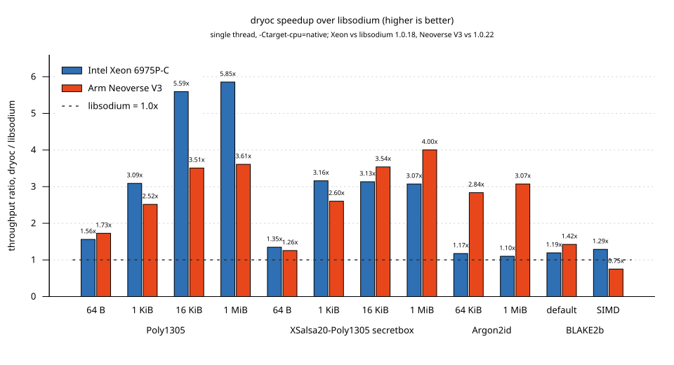

[](https://docs.rs/dryoc) [](https://crates.io/crates/dryoc) [](https://github.com/brndnmtthws/dryoc/actions/workflows/build-and-test.yml) [](https://app.codecov.io/gh/brndnmtthws/dryoc/)

[💬 Join the Matrix chat](https://matrix.to/#/#dryoc:frens.io)

# dryoc: Don't Roll Your Own Crypto™<sup>[^1]</sup>

dryoc is a general-purpose cryptography library written in pure Rust. It
implements many of the same algorithms and wire formats as
[libsodium](https://doc.libsodium.org/), so supported operations can
interoperate with libsodium.


The _Classic_ API closely follows libsodium's functions and types, which makes
it useful when porting existing code. The _Rustaceous_ API provides typed Rust
interfaces that make key, nonce, and output sizes explicit: fixed-size inputs
such as keys, nonces, and public keys only accept fixed-size types, so convert
runtime-length bytes with `try_into()`, which rejects the wrong length. Both
APIs use the same implementations and can be used together.

dryoc does not implement every libsodium feature. See [Project status](#project-status)
for current coverage.

See the [API documentation](https://docs.rs/dryoc/latest/dryoc/) and
[integration tests](tests/integration_tests.rs) for examples.

## Features

* Pure Rust, with no hidden C libraries
* Limited use of unsafe code[^2]
* Classic and typed Rustaceous APIs for many libsodium operations
* Post-quantum key encapsulation with ML-KEM-768 and the X-Wing hybrid of
  ML-KEM-768 and X25519, and post-quantum sealed boxes built on X-Wing
* WebAssembly support through the `wasm32-unknown-unknown` target
* `no_std` support, with or without `alloc`; see [Cargo features](#cargo-features)
* Protected memory on Unix and Windows, enabled by default with the
  `protected` feature
* Password-hash string helpers, enabled by default with the `base64` feature
* Optional [Serde](https://serde.rs/) and
  [wincode](https://crates.io/crates/wincode) serialization
* Optimized AArch64 and x86-64 implementations; those that need optional CPU
  extensions are selected at runtime (at compile time without `std`), and CPUs
  without them use portable code
* Optional [portable SIMD](https://doc.rust-lang.org/std/simd/index.html)
  implementations on nightly Rust with `features = ["simd_backend", "nightly"]`
* Curve25519 and Ed25519 group arithmetic implemented in dryoc;
  [curve25519-dalek](https://github.com/dalek-cryptography/curve25519-dalek)
  provides scalar arithmetic modulo the group order
* Portable SHA-256 and SHA-512 compression and the Keccak permutation from the
  [RustCrypto](https://github.com/RustCrypto) project

## Performance

On the optimized workloads shown below, dryoc is faster than libsodium 1.0.18
on both x86-64 and AArch64. Each result compares the two libraries in the same
process, using the same buffers, one thread, and `-Ctarget-cpu=native`:

| Workload | Intel Xeon 6975P-C (AVX-512) | Arm Neoverse V3 (NEON/SVE2) |
| --- | ---: | ---: |
| Poly1305, 1 MiB | `5.85x faster` | `3.28x faster` |
| Poly1305, 16 KiB | `5.59x faster` | `3.14x faster` |
| XSalsa20-Poly1305 secretbox, 1 MiB | `3.07x faster` | `2.84x faster` |
| XSalsa20-Poly1305 secretbox, 1 KiB | `3.16x faster` | `2.04x faster` |
| BLAKE2b, 694,200 B | `1.19x faster` | `1.43x faster` |



These results do not require `-Ctarget-cpu=native`: the optimized Poly1305
and Salsa20 implementations, and the x86-64 BLAKE2b implementation, are
selected automatically at runtime, while the AArch64 BLAKE2b rounds use only
baseline instructions. Omitting the flag changes the results above by no more
than 6%. Argon2id results vary more with the machine and build flags.

Against libsodium 1.0.22, ML-KEM-768 key generation, encapsulation and
decapsulation are `1.87x`, `1.89x` and `1.93x` faster on the Neoverse V3,
and X-Wing is `1.33x`–`1.45x` faster. See
[BENCHMARKS.md](BENCHMARKS.md) for the full results, test environment, builds
without CPU-specific flags, and workloads where libsodium is as fast or faster.

## Rust version

dryoc uses the Rust 2024 edition and requires Rust 1.89 or newer, as declared
by `rust-version` in `Cargo.toml`.

The optional portable SIMD implementations require nightly Rust and
`--features simd_backend,nightly`. The `simd_backend` feature selects those
implementations, while `nightly` enables Rust's unstable `portable_simd` API.

With `protected`, the `nightly` feature also implements the standard
`Allocator` trait for the protected-memory `PageAlignedAllocator`. It requires
`nightly-2026-09-24` or later (rustc 1.100.0-nightly from 2026-09-23), where that API no longer
needs a feature gate; older nightlies fail to compile with `--features nightly`.

Optimized AArch64 and x86-64 implementations are built in and do not require
the `simd_backend` feature. Implementations that need optional CPU extensions,
such as NEON, SVE2, the SHA-2 and SHA-3 instructions, AVX2, AVX-512, and BMI2,
are selected at runtime when the CPU supports them, or from the compile-time
target features without `std` (see [Cargo features](#cargo-features)). The
AArch64 `asm!`
implementations of the BLAKE2b rounds, the scalar ChaCha20 rounds, and
Curve25519 field multiplication use only baseline instructions and are used on
that architecture outside Miri. Curve25519 and Ed25519 group operations are
also unaffected by the `simd_backend` feature.

## Cargo features

| Feature | Default | Enables |
| --- | --- | --- |
| `std` | Yes | `alloc`, runtime CPU feature detection, and the `Error::Io` variant |
| `alloc` | With `std` | APIs that allocate: the `Vec<u8>` byte-trait implementations, the `VecBox`, `VecEnvelope`, `VecSignedMessage` and `VecPwHash` aliases, the `*_to_vec` and `*_to_vecbox` helpers, `randombytes_buf`, and password hashing (`pwhash` and `crypto_pwhash`) |
| `protected` | Yes | Protected memory on Unix and Windows; implies `std` |
| `base64` | Yes | Password-hash string helpers; implies `alloc` |
| `serde` | No | Serde support; the `Vec`-based types also need `alloc` |
| `wincode_0_6` | No | wincode 0.6 support for the `Vec`-based boxes; implies `alloc` |
| `simd_backend` | No | Portable SIMD implementations; requires `nightly` |
| `nightly` | No | Nightly-only APIs (see [Rust version](#rust-version)); the `Allocator` implementation also needs `protected` |

dryoc is `#![no_std]`. With no features at all, everything that works on
fixed-size arrays and caller-provided slices is available: the Classic API
except `crypto_pwhash`, the stack-allocated Rustaceous types, and the
primitives. Enable `alloc` on targets with a global allocator for the
`Vec`-based APIs:

```toml
dryoc = { version = "2", default-features = false, features = ["alloc"] }
```

Without `std`, implementations that need optional CPU extensions are chosen
from the target features enabled at compile time, for example with
`-C target-feature=+avx2` or `-C target-cpu=native`, in the same priority order
as runtime detection; the portable implementations are used otherwise.

Random generation uses [getrandom](https://docs.rs/getrandom), which does not
need `std`. Bare-metal targets such as `thumbv7em-none-eabihf` and
`aarch64-unknown-none` have no system entropy source: build them with
`RUSTFLAGS='--cfg getrandom_backend="custom"'` and provide a
[custom backend](https://docs.rs/getrandom/latest/getrandom/#custom-backend).

Upgrading from dryoc 1.x: `default-features = false` used to keep every API
except protected memory and the password-hash strings. Add
`features = ["std"]` (or `["alloc"]` on targets without `std`) to keep them.

## Optional serialization

Enable `serde` to derive [`serde::Serialize`](https://docs.rs/serde/latest/serde/trait.Serialize.html)
and [`serde::Deserialize`](https://docs.rs/serde/latest/serde/trait.Deserialize.html)
for supported data structures.

Enable `wincode_0_6` to implement [`wincode::SchemaWrite`](https://docs.rs/wincode/0.6/wincode/trait.SchemaWrite.html)
and [`wincode::SchemaRead`](https://docs.rs/wincode/0.6/wincode/trait.SchemaRead.html)
from wincode 0.6 for the `VecBox` aliases in `dryocbox` and `dryocsecretbox`,
and for the `VecBox` and `VecEnvelope` aliases in `dryocaead`.

wincode is pre-1.0 and its traits are part of dryoc's public API, so the
feature name carries the wincode version. Support for a future wincode release
will be added as a new feature (for example, `wincode_0_7`) alongside the
existing ones, so upgrading wincode does not require a new dryoc major version.

## Security

dryoc has not undergone a third-party security audit. Its compatibility tests,
Rust types, and limited use of unsafe code reduce some classes of defects, but
do not guarantee that an application is secure. Applications must still follow
the documented key and nonce rules, protect secret material, handle errors, and
choose primitives appropriate for their protocol.

## Project status

The following features are implemented. Entries that mirror libsodium have
been checked against [libsodium 1.0.22](https://github.com/jedisct1/libsodium/releases/tag/1.0.22-RELEASE):

* [x] [Public-key authenticated encryption](https://docs.rs/dryoc/latest/dryoc/dryocbox/index.html) (`crypto_box_*`) [libsodium link](https://doc.libsodium.org/public-key_cryptography/authenticated_encryption)
* [x] [Secret-key authenticated encryption](https://docs.rs/dryoc/latest/dryoc/dryocsecretbox/index.html) (`crypto_secretbox_*`) [libsodium link](https://doc.libsodium.org/secret-key_cryptography/secretbox)
* [x] [Curve25519 scalar multiplication](https://docs.rs/dryoc/latest/dryoc/classic/crypto_core/index.html) (`crypto_scalarmult*`) [libsodium link](https://doc.libsodium.org/advanced/scalar_multiplication)
* [x] Zeroing memory (`sodium_memzero`) with [zeroize](https://crates.io/crates/zeroize) [libsodium link](https://doc.libsodium.org/memory_management)
* [x] [Generating random data](https://docs.rs/dryoc/latest/dryoc/rng/index.html) (`randombytes_buf`) [libsodium link](https://doc.libsodium.org/generating_random_data)
* [x] [Encrypted streams](https://docs.rs/dryoc/latest/dryoc/dryocstream/index.html) (`crypto_secretstream_*`) [libsodium link](https://doc.libsodium.org/secret-key_cryptography/secretstream)
* [x] [XChaCha20-Poly1305-IETF AEAD](https://docs.rs/dryoc/latest/dryoc/dryocaead/index.html) (`crypto_aead_xchacha20poly1305_ietf_*`) [libsodium link](https://doc.libsodium.org/secret-key_cryptography/aead/chacha20-poly1305/xchacha20-poly1305_construction)
* [x] [ChaCha20-Poly1305-IETF AEAD](https://docs.rs/dryoc/latest/dryoc/dryocaead/chacha20poly1305_ietf/index.html) (`crypto_aead_chacha20poly1305_ietf_*`) [libsodium link](https://doc.libsodium.org/secret-key_cryptography/aead/chacha20-poly1305/ietf_chacha20-poly1305_construction)
* [x] [Memory locking](https://docs.rs/dryoc/latest/dryoc/protected/index.html) (`sodium_mlock`, `sodium_munlock`, `sodium_mprotect_*`) [libsodium link](https://doc.libsodium.org/memory_management)
* [x] [Encrypting related messages](https://docs.rs/dryoc/latest/dryoc/utils/fn.increment_bytes.html) (`sodium_increment`) [libsodium link](https://doc.libsodium.org/secret-key_cryptography/encrypted-messages)
* [x] [Generic hashing](https://docs.rs/dryoc/latest/dryoc/generichash/index.html) (`crypto_generichash_*`) [libsodium link](https://doc.libsodium.org/hashing/generic_hashing)
* [x] [Secret-key authentication](https://docs.rs/dryoc/latest/dryoc/auth/index.html) (`crypto_auth*`) [libsodium link](https://doc.libsodium.org/secret-key_cryptography/secret-key_authentication)
* [x] [One-time authentication](https://docs.rs/dryoc/latest/dryoc/onetimeauth/index.html) (`crypto_onetimeauth_*`) [libsodium link](https://doc.libsodium.org/advanced/poly1305)
* [x] [Sealed boxes](https://docs.rs/dryoc/latest/dryoc/dryocbox/struct.DryocBox.html#method.seal) (`crypto_box_seal*`) [libsodium link](https://doc.libsodium.org/public-key_cryptography/sealed_boxes)
* [x] [Key derivation](https://docs.rs/dryoc/latest/dryoc/kdf/index.html) (`crypto_kdf_*`) [libsodium link](https://doc.libsodium.org/key_derivation)
* [x] [Key exchange](https://docs.rs/dryoc/latest/dryoc/kx/index.html) (`crypto_kx_*`) [libsodium link](https://doc.libsodium.org/key_exchange)
* [x] [Post-quantum key encapsulation](https://docs.rs/dryoc/latest/dryoc/kem/index.html) with X-Wing and ML-KEM-768 (`crypto_kem_*`, `crypto_kem_xwing_*`, `crypto_kem_mlkem768_*`) [libsodium link](https://doc.libsodium.org/public-key_cryptography/key_encapsulation)
* [x] [Post-quantum sealed boxes](https://docs.rs/dryoc/latest/dryoc/dryocsealedbox/index.html): HPKE (RFC 9180) with X-Wing, HKDF-SHA256 and ChaCha20-Poly1305 (dryoc extension) [RFC 9180 link](https://www.rfc-editor.org/rfc/rfc9180.html)
* [x] [Public-key signatures](https://docs.rs/dryoc/latest/dryoc/sign/index.html) (`crypto_sign_*`) [libsodium link](https://doc.libsodium.org/public-key_cryptography/public-key_signatures)
* [x] [Ed25519 to Curve25519](https://docs.rs/dryoc/latest/dryoc/classic/crypto_sign_ed25519/index.html) (`crypto_sign_ed25519_*`) [libsodium link](https://doc.libsodium.org/advanced/ed25519-curve25519)
* [x] [Signature secret-key extraction helpers](https://docs.rs/dryoc/latest/dryoc/classic/crypto_sign_ed25519/index.html) (`crypto_sign_ed25519_sk_to_seed`, `crypto_sign_ed25519_sk_to_pk`) [libsodium link](https://doc.libsodium.org/public-key_cryptography/public-key_signatures)
* [x] [SHA-2 hashing](https://docs.rs/dryoc/latest/dryoc/classic/crypto_hash/index.html) (`crypto_hash_sha256_*`, `crypto_hash_sha512_*`) [libsodium link](https://doc.libsodium.org/advanced/sha-2_hash_function)
* [x] [SHA-3 hashing](https://docs.rs/dryoc/latest/dryoc/sha3/index.html) (`crypto_hash_sha3256_*`, `crypto_hash_sha3512_*`) [NIST FIPS 202 link](https://nvlpubs.nist.gov/nistpubs/fips/nist.fips.202.pdf)
* [x] [Extendable-output functions](https://docs.rs/dryoc/latest/dryoc/xof/index.html) (`crypto_xof_shake128_*`, `crypto_xof_shake256_*`, `crypto_xof_turboshake128_*`, `crypto_xof_turboshake256_*`) [libsodium link](https://doc.libsodium.org/hashing/xof)
* [x] [Short-input hashing](https://docs.rs/dryoc/latest/dryoc/classic/crypto_shorthash/index.html) (`crypto_shorthash`) [libsodium link](https://doc.libsodium.org/hashing/short-input_hashing)
* [x] [Password hashing](https://docs.rs/dryoc/latest/dryoc/pwhash/index.html) (`crypto_pwhash_*`) [libsodium link](https://doc.libsodium.org/password_hashing/default_phf)
* [x] [HKDF key derivation variants](https://docs.rs/dryoc/latest/dryoc/hkdf/index.html) (`crypto_kdf_hkdf_sha256_*`, `crypto_kdf_hkdf_sha512_*`) [libsodium link](https://doc.libsodium.org/key_derivation/hkdf)
* [x] [Direct HMAC authentication variants](https://docs.rs/dryoc/latest/dryoc/hmac/index.html) (`crypto_auth_hmacsha256_*`, `crypto_auth_hmacsha512_*`, `crypto_auth_hmacsha512256_*`) [libsodium link](https://doc.libsodium.org/secret-key_cryptography/secret-key_authentication)

The following libsodium features are incomplete, internal only, or not
implemented. Other crates may provide equivalent functionality:

* [ ] [AEAD constructions](https://doc.libsodium.org/secret-key_cryptography/aead) beyond the ChaCha20-Poly1305-IETF variants, including AEGIS-128L/256, AES256-GCM, and the legacy 64-bit-nonce ChaCha20-Poly1305 construction
* [ ] XChaCha20-Poly1305 box and secretbox variants (`crypto_box_curve25519xchacha20poly1305_*`, `crypto_secretbox_xchacha20poly1305_*`)
* [ ] Deterministic random data for reproducible tests (`randombytes_buf_deterministic`)
* [ ] Short-input hash variants beyond SipHash-2-4 with 64-bit output (`crypto_shorthash_siphashx24_*`)
* [ ] [IP address encryption](https://doc.libsodium.org/secret-key_cryptography/ip_address_encryption) (`crypto_ipcrypt_*`, `sodium_ip2bin`, `sodium_bin2ip`), added in libsodium 1.0.21
* [ ] [Helpers](https://doc.libsodium.org/helpers), [padding](https://doc.libsodium.org/padding), and constant-time verify utilities (`sodium_*`, `crypto_verify_*`)
* [ ] Standalone [stream cipher](https://doc.libsodium.org/advanced/stream_ciphers) APIs (`crypto_stream_*`; use the [salsa20](https://crates.io/crates/salsa20) or [chacha20](https://crates.io/crates/chacha20) crates directly instead)
* [ ] [Advanced features](https://doc.libsodium.org/advanced):
  * [ ] Keccak-f[1600] core permutation (`crypto_core_keccak1600_*`)
  * [ ] [Scrypt](https://doc.libsodium.org/advanced/scrypt) (`crypto_pwhash_scryptsalsa208sha256_*`; use the [scrypt](https://crates.io/crates/scrypt) crate directly instead)
  * [ ] [Finite field and group arithmetic](https://doc.libsodium.org/advanced/point-arithmetic) (`crypto_core_ed25519_*`, `crypto_core_ristretto255_*`; try the [curve25519-dalek](https://crates.io/crates/curve25519-dalek) crate)
  * [ ] Ed25519 and Ristretto255 scalar multiplication variants (`crypto_scalarmult_ed25519_*`, `crypto_scalarmult_ristretto255_*`)

## Other NaCl-related Rust implementations

* [sodiumoxide](https://crates.io/crates/sodiumoxide)
* [crypto_box](https://crates.io/crates/crypto_box)

[^1]: Not actually trademarked.

[^2]: Protected memory is available on Unix and Windows with the default
`protected` feature. It requires custom allocation, system calls, and pointer
arithmetic, which are unsafe in Rust. Some optimized implementations also use
small, carefully bounded unsafe blocks. The in-crate unsafe inventory includes
wincode schema implementations for vector-backed boxes and AEAD envelopes,
BLAKE2b parameter byte views, protected memory guarded heap buffers with their
fixed-size byte views and OS protection calls (made on recorded address
ranges, so no-access pages are never referenced), 16-byte volatile zeroization of
secret buffers, the x86-64 backends
(detected AVX2, AVX-512 and AVX-512 IFMA entry points for ChaCha20,
XSalsa20, Poly1305, the Argon2 block compression, the BLAKE2b compression,
the ML-KEM polynomial arithmetic and the 4-way Keccak permutation,
`asm!` scalar ChaCha20 and Salsa20 double rounds that run beside the AVX-512
lane sets, an AVX-512
Ed25519 basepoint table lookup, and BMI2-compiled copies of the Curve25519
scalar multiplication, inversion and square-root loops), and the AArch64
backends: detected NEON entry points for Poly1305, XSalsa20, ChaCha20,
the Ed25519 basepoint table lookup and the ML-KEM polynomial arithmetic (with
16-byte coefficient-row loads and stores), register-only SVE2 `asm!` blocks for
the ChaCha20 and XSalsa20 rounds, scalar `asm!` blocks for the ChaCha20 and
BLAKE2b rounds and the Curve25519 field products, and detected
`sha2`/`sha3` instruction `asm!` loops for the SHA-256 and SHA-512
compression functions. CPU features are detected at runtime with the `std`
feature and taken from the compile-time target features without it.
The [rustdoc unsafe code summary](https://docs.rs/dryoc/latest/dryoc/#unsafe-code)
lists every non-test use of unsafe code in this crate.
