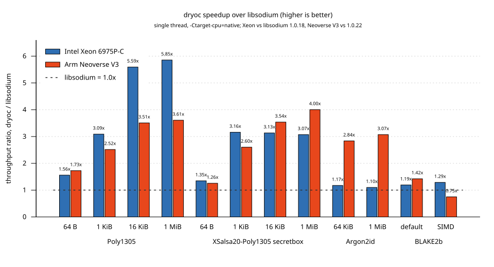

[](https://docs.rs/dryoc) [](https://crates.io/crates/dryoc) [](https://github.com/brndnmtthws/dryoc/actions/workflows/build-and-test.yml) [](https://app.codecov.io/gh/brndnmtthws/dryoc/)

[💬 Join the Matrix chat](https://matrix.to/#/#dryoc:frens.io)

# dryoc: Don't Roll Your Own Crypto™<sup>[^1]</sup>

**dryoc** is a high-performance, pure-Rust cryptography library. It delivers exceptional speed — up to **4x faster** than libsodium — alongside modern post-quantum cryptography (ML-KEM-768, X-Wing hybrid, HPKE), protected memory, and `#![no_std]` support.


## Why dryoc?

* **BLAZING FAST:** Pure Rust kernels with runtime CPU feature detection (AVX-512, AVX2, NEON, SVE2) optimized to outperform native C implementations.
* **POST-QUANTUM READY:** Modern post-quantum key encapsulation (ML-KEM-768), X-Wing hybrid (ML-KEM + X25519), and RFC 9180 HPKE sealed boxes.
* **TYPE-SAFE RUSTACEOUS API:** Strong, fixed-size Rust types for keys, nonces, and ciphertexts prevent compile-time and runtime length/type errors.
* **CLASSIC LIBSODIUM INTEROP:** Drop-in compatibility surface (`crypto_*`) matching libsodium wire formats and functions for seamless integration or migration.
* **HARDENED & FLEXIBLE:** Protected memory allocation (Unix/Windows), memory zeroization, `#![no_std]` / `alloc` compatibility, and Serde support.
* **PYTHON & WASM SUPPORT:** First-class Python 3.11+ bindings (`pip install dryoc`, with free-threaded CPython support) and WebAssembly (`wasm32-unknown-unknown`) support with optional SIMD.

---

## Quick Start

Add `dryoc` to your `Cargo.toml`:

```toml
[dependencies]
dryoc = "2"
```

### Type-Safe Rustaceous API (Recommended)

```rust
use dryoc::dryocsecretbox::*;
use dryoc::types::*;

// Generate a random key and nonce using type-safe fixed-size arrays
let key = Key::generate();
let nonce = Nonce::generate();
let message = b"Hello, post-quantum world!";

// Encrypt and authenticate in one step
let box_ = DryocSecretBox::encrypt_to_vecbox(message, &nonce, &key).expect("encryption failed");
let decrypted = box_.decrypt_to_vec(&nonce, &key).expect("authentication failed");
assert_eq!(message, &decrypted[..]);
```

---

## Performance

Measured in single-threaded benchmark runs (`-Ctarget-cpu=native`, same process and buffers) comparing `dryoc` against libsodium 1.0.22:

| Workload | Intel Xeon 6975P-C (AVX-512) | Arm Neoverse V3 (NEON/SVE2) |
| --- | ---: | ---: |
| **Poly1305 (1 MiB)** | **4.29x faster** | **3.61x faster** |
| **XSalsa20-Poly1305 (1 MiB)** | **2.71x faster** | **4.00x faster** |
| **XSalsa20-Poly1305 (1 KiB)** | **3.27x faster** | **2.60x faster** |
| **BLAKE2b (694 KiB)** | **1.17x faster** | **1.42x faster** |



*No special compiler flags required:* CPU extensions (AVX-512, AVX2, NEON, SVE2, SHA-2/SHA-3) are detected at runtime with `std`. Post-quantum operations (ML-KEM-768, X-Wing) achieve **1.5x–3.8x** performance gains over reference C code. Detailed benchmarks and methodology are available in [BENCHMARKS.md](BENCHMARKS.md).

---

## Post-Quantum & Modern Features

`dryoc` goes beyond classic NaCl/libsodium algorithms with state-of-the-art primitives:

* **ML-KEM-768 & X-Wing Hybrid:** NIST FIPS 203 post-quantum key encapsulation mechanism and the X-Wing post-quantum hybrid scheme (ML-KEM-768 + X25519).
* **HPKE Sealed Boxes:** RFC 9180 Hybrid Public Key Encryption using X-Wing, HKDF-SHA256, and ChaCha20-Poly1305.
* **SHA-3 & XOF:** SHA3-256/512 and SHAKE/TurboSHAKE extendable-output functions based on Keccak.

---

## Cargo Features

| Feature | Default | Description |
| --- | --- | --- |
| `std` | **Yes** | Enables `alloc`, runtime CPU feature detection, and `Error::Io`. |
| `alloc` | *With `std`* | Heap-allocating APIs (`Vec<u8>` conversions, `VecBox` types, `pwhash`). |
| `protected` | **Yes** | Guarded, page-aligned protected memory on Unix and Windows (implies `std`). |
| `serde` | **Yes** | `Serialize` / `Deserialize` implementations for keys, nonces, and ciphertexts. |
| `base64` | **Yes** | Password hashing string helpers (implies `alloc`). |
| `wincode_0_6` | No | Direct binary serialization via `wincode 0.6` for box types (implies `alloc`). |
| `simd_backend` | No | Opt-in portable SIMD implementations (requires `nightly`). |
| `nightly` | No | Nightly toolchain support for `portable_simd` and `Allocator` impls. |

### `#![no_std]` Support

`dryoc` is `#![no_std]` compatible out of the box. Fixed-size arrays and stack-allocated types work without heap allocation or `std`:

```toml
dryoc = { version = "2", default-features = false }
```

Enable `features = ["alloc"]` on embedded/custom targets with a heap allocator.

---

## Platform Support & WebAssembly

* **x86_64 & AArch64:** Hand-optimized SIMD and assembly kernels with automatic runtime CPU dispatch.
* **WebAssembly (`wasm32-unknown-unknown`):** Supported out of the box. Compile with `RUSTFLAGS=-Ctarget-feature=+simd128` to enable WebAssembly SIMD kernels.
* **Python Bindings:** High-performance Pythonic bindings available on PyPI via `pip install dryoc` (see [python/README.md](python/README.md)).

---

## Security & Unsafe Code

`dryoc` minimizes `unsafe` code, confining it to OS protected memory calls, zeroization, and vectorized SIMD/assembly kernels. Full details are documented in the [unsafe code inventory](https://docs.rs/dryoc/latest/dryoc/unsafe_code/index.html).

---

## License & Acknowledgements

Licensed under the MIT License. Inspired by and compatible with [libsodium](https://doc.libsodium.org/) and [NaCl](https://nacl.cr.yp.to/).

[^1]: Not actually trademarked.
